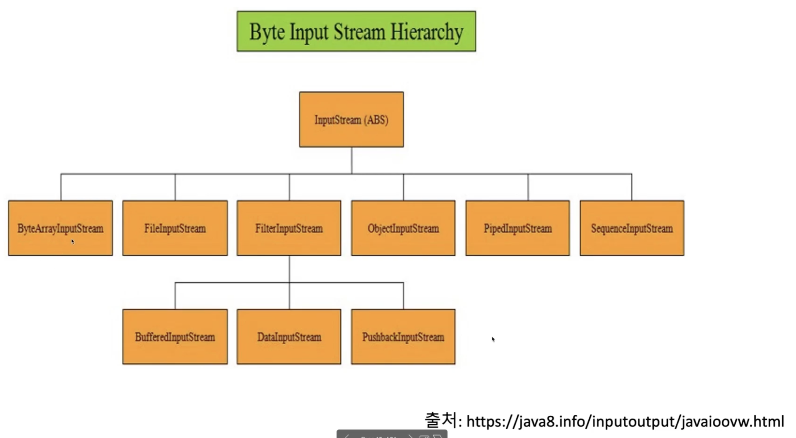

### Reader, Writer

- 추상 클래스
- char단위 입출력 클래스는 Rader, Writer의 후손이다.

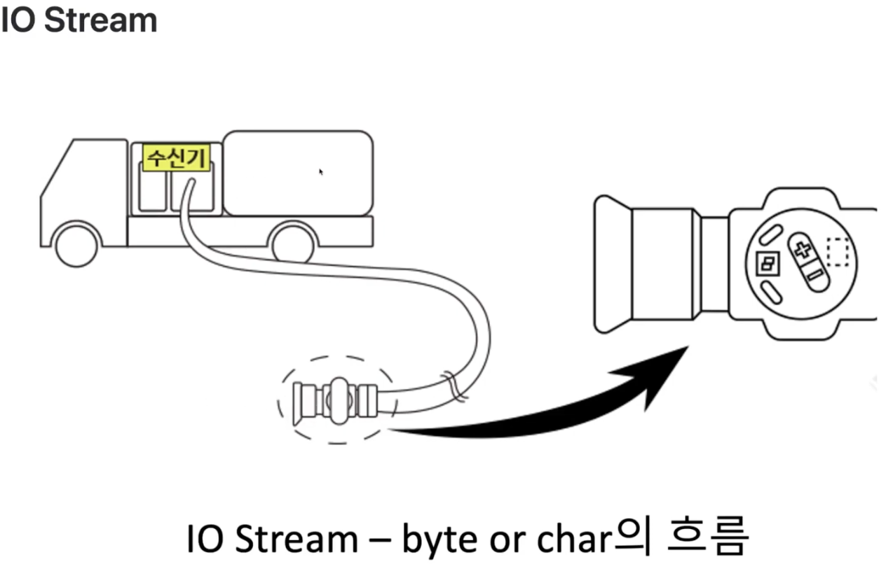


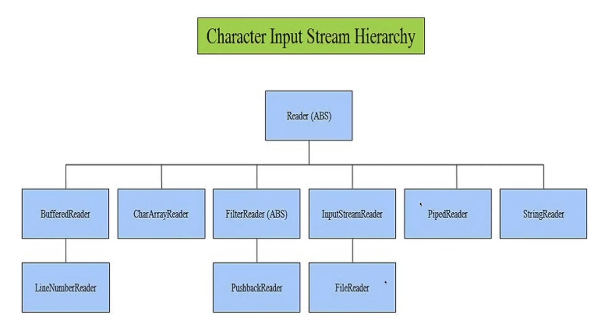

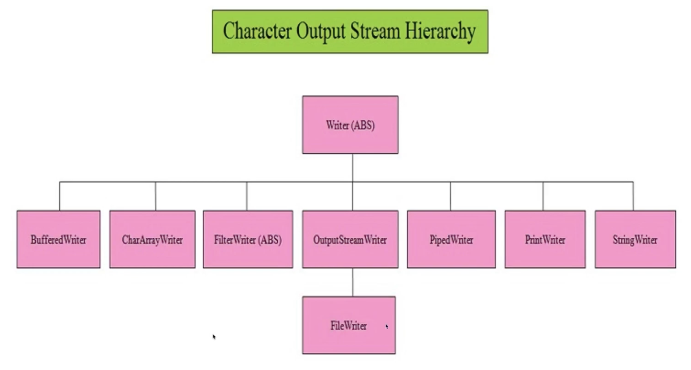

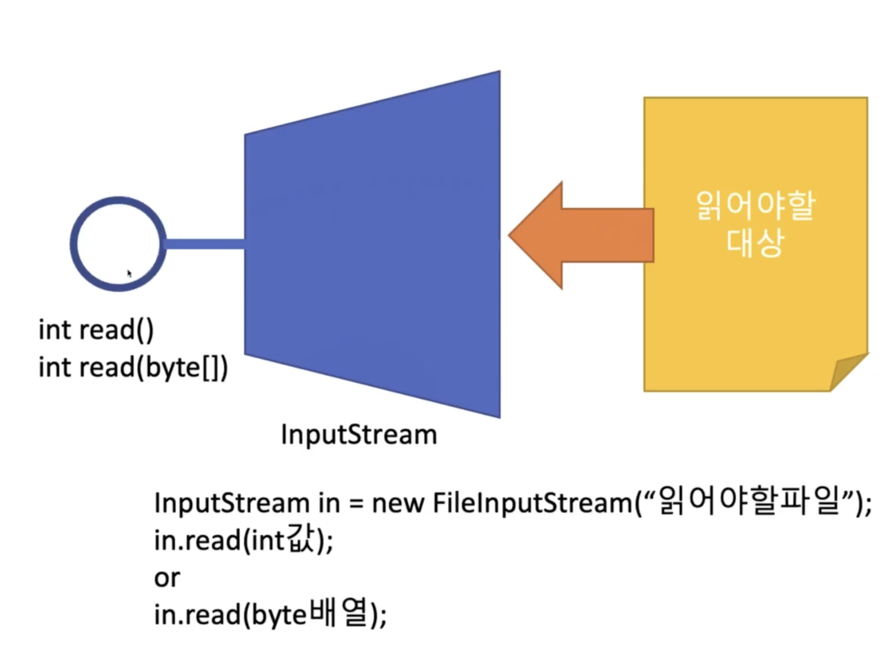

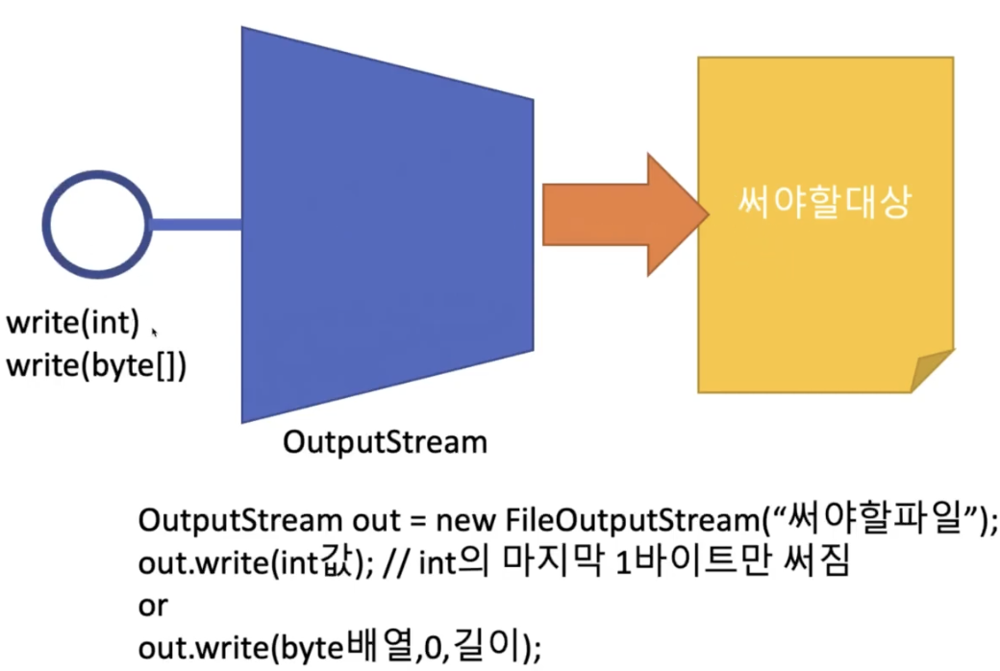

```java
package javaIO;

import java.io.FileOutputStream;
import java.io.OutputStream;

public class HelloIO01 {
    public static void main(String[] args) throws Exception{
        OutputStream out = new FileOutputStream("/tmp/helloio01.dat");
        out.write(1); // 0000 0000      0000 0000       0000 0000       0000 0001
        out.write(255);
        out.write(0);
        out.close();
    }
}
```

```java
package javaIO;

import java.io.FileInputStream;
import java.io.InputStream;

public class HelloIO02 {
    public static void main(String[] args) throws Exception{
        InputStream in = new FileInputStream("/tmp/helloio01.dat");
//        int i1 = in.read();
//        System.out.println(i1); // 1 첫번째 바이트를 읽게됨
//        int i2 = in.read();
//        System.out.println(i2); // 255 두번째 바이트를 읽게됨
//        int i3 = in.read(); 
//        System.out.println(i3); // 0 세번째 바이트를 읽게됨
//        int i4 = in.read();
//        System.out.println(i4); // -1 (파일의 끝)
        int buf = -1;
        while((buf = in.read()) != -1) { // 더 이상 읽을게 없을 때
            System.out.println(buf);
        }
        in.close();
    }
}
```

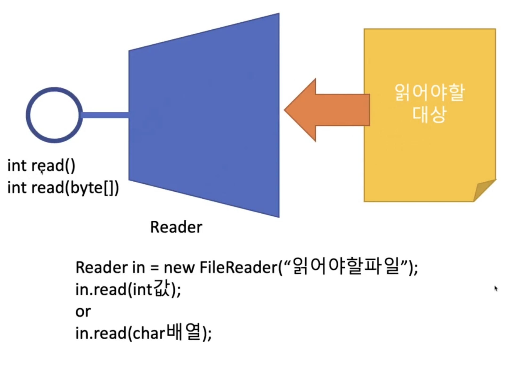

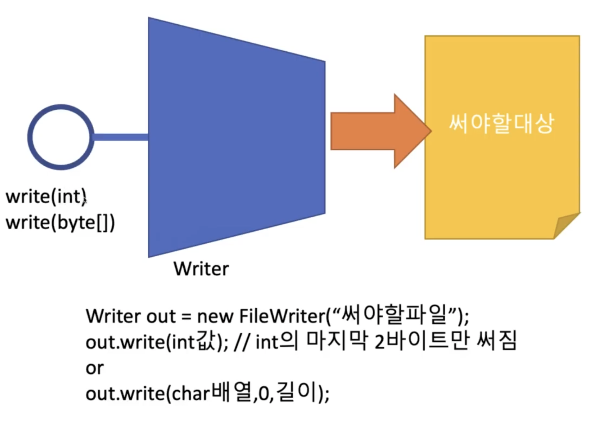

### 추상 클래스라서 new Reader 이런게 안됨

```java
package javaIO;

import java.io.File;
import java.io.FileReader;
import java.io.Reader;

public class HelloIO04 {
    public static void main(String[] args) throws Exception{
        Reader in = new FileReader("/tmp/hello.txt");
//        int ch1 = in.read();
//        System.out.println((char)ch1);
//        int ch2 = in.read();
//        System.out.println((char) ch2);
//        int ch3 = in.read();
//        System.out.println((char) ch3);
//        int ch4 = in.read();
//        System.out.println(ch4);
        int ch = -1;
        while((ch = in.read()) != -1) {
            System.out.println((char)ch);
        }
        in.close();
    }
}
```

```java
package javaIO;

import java.io.FileWriter;
import java.io.Writer;

public class HelloIO03 {
    public static void main(String[] args) throws Exception {
        Writer out = new FileWriter("/tmp/hello.txt");
				// 정수로 형변화해서 저장
        out.write((int)'가');
        out.write((int)'나');
        out.write((int)'다');
        out.close();
    }
}
```

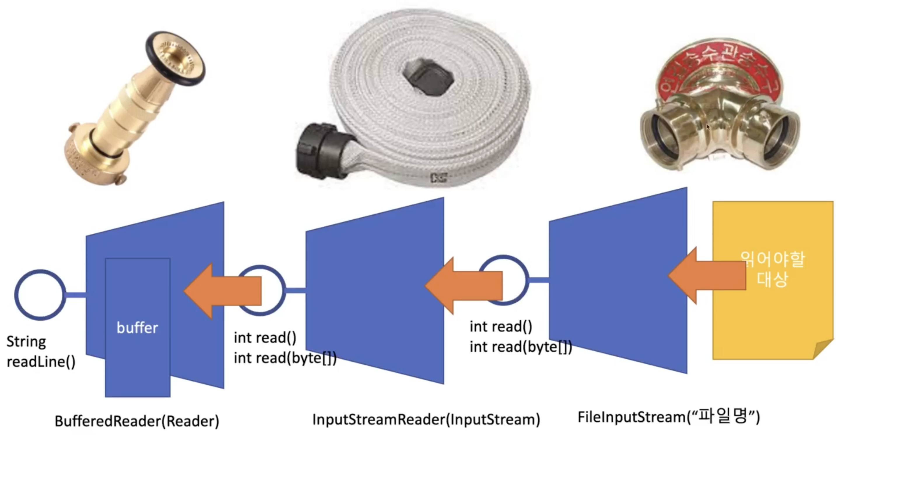

```java
package JavaIO;

import java.io.FileNotFoundException;
import java.io.FileOutputStream;
import java.io.OutputStreamWriter;
import java.io.PrintWriter;

public class HelloIO05 {
    public static void main(String[] args) throws Exception {
        // FileOutputStream은 "/tmp/my.txt"에 저장한다
        // FileOutputStream은 write(int); int의 마지마 byte만 저장
        // OutPutStreamWriter 생성자에 들어온 OutputStream의 write()을 이용하여 쓴다.
        // OutPutStreamWriter는 write(int); int의 끝부분 char를 저장
        // PrintWriter는 생성자에 들어온 OutputStreamWrite의 write()을 이용하여 쓴다.
        // PrintWriter는 println(문자열); 문자열을 출력한다.
        PrintWriter out = new PrintWriter(new OutputStreamWriter(new FileOutputStream("/tmp/my.txt")));
        out.println("hello");
        out.println("world");
        out.println("!!!!!");
        out.close();
    }
}
```

```java
package JavaIO;

import java.io.BufferedReader;
import java.io.FileInputStream;
import java.io.InputStreamReader;

public class HelloIO06 {
    public static void main(String[] args) throws Exception{
        BufferedReader in = new BufferedReader(new InputStreamReader(new FileInputStream("/tmp/my.txt")));

//        String line1 = in.readLine(); // hello
//        String line2 = in.readLine(); // world
//        String line3 = in.readLine(); // !!!!!
//        String line4 = in.readLine(); // null
//        System.out.println(line1);
//        System.out.println(line2);
//        System.out.println(line3);
//        System.out.println(line4);
        String line = null;
        while ((line = in.readLine()) != null) {
            System.out.println(line);
        }
        in.close();
    }
}
```

### 파일과 폴더를 다이어그램으로 표현해보자

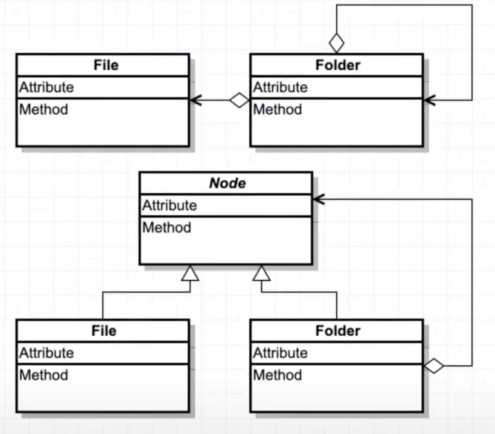

- 폴더가 파일을 가진다. 폴더가 폴더를 가진다.
- Node : 공통점
- 폴더가 노드를 가진다

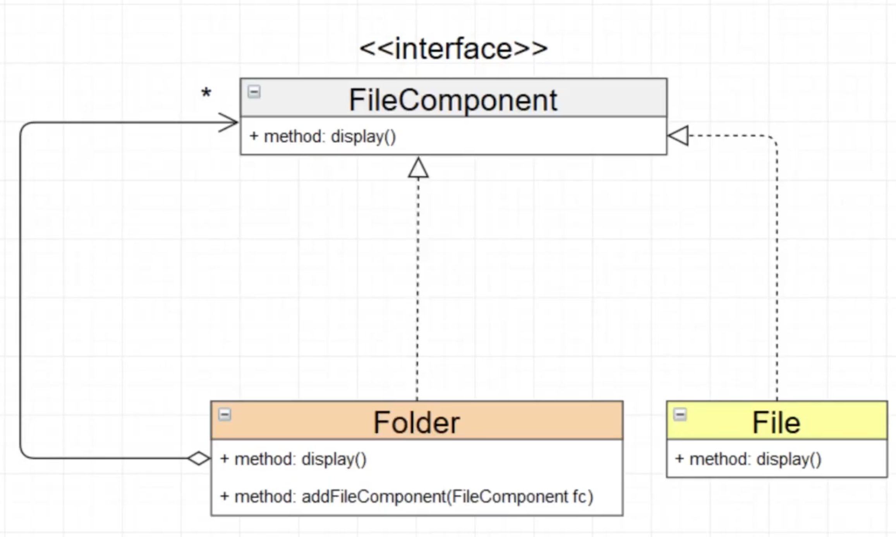

- 컴포지트 패턴