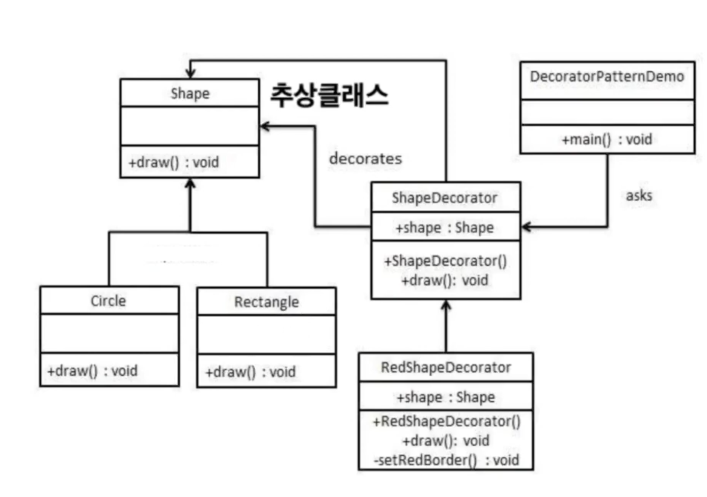

- 컴포지트 패턴

### 예시

```java
package JavaIO;

public abstract class Node {
    private String name;

    public Node(String name) {
        this.name = name;
    }

    public String getName() {
        return name;
    }

    public void setName(String name) {
        this.name = name;
    }

    public abstract long getSize();
    public abstract boolean isFolder();
}
```

```java
package composite;

public class File extends Node{
    private long size;

    public  File(String name, long size) {
        super(name);
        this.size = size;
    }

    @Override
    public long getSize() {return this.size;}

    @Override
    public boolean isFolder() {return false;}
}
```

```java
package composite;

import java.util.ArrayList;
import java.util.List;

public class Folder extends Node{
    private List<Node> nodes;

    public Folder(String name) {
        super(name);
        nodes = new ArrayList<>();
    }

    // 오버로딩
    public void add(File file) {nodes.add(file);}

    public void add(Folder folder) {nodes.add(folder);}

    @Override
    public long getSize() {
        long total = 0L;
        for(int i=0; i< nodes.size(); i++) {
            total = total + nodes.get(i).getSize();
        }
        return total;
    }

    @Override
    public boolean isFolder() {
        return true;
    }
}
```

```java
package composite;

public class CompositePatternDemo {
    public static void main(String[] args) {
        File f1 = new File("file1", 10L);
        File f2 = new File("file2", 20L);
        File f3 = new File("file3", 30L);

        Folder folder1 = new Folder("folder1");
        Folder folder2 = new Folder("folder2");

        folder1.add(f1);
        folder1.add(folder2);

        folder2.add(f2);
        folder2.add(f3);

        System.out.println(folder1.getSize());
    }
}
```



```java
package decorator;

public class Circle extends Shape{

    @Override
    public void draw() {
        System.out.println("Shape : Circle");
    }
}
```

```java
package decorator;

public class Rectangle extends Shape{

    @Override
    public void draw() {
        System.out.println("Shape : Rectangle");
    }
}
```

```java
package decorator;

public abstract class ShapeDecorator extends Shape{
    protected Shape decoratedShape;

    public ShapeDecorator(Shape decoratedShape) {this.decoratedShape = decoratedShape;}

    public void draw() {decoratedShape.draw();}
}
```

```java
package decorator;

public class RedShapeDecorator extends ShapeDecorator{

    public RedShapeDecorator(Shape decoratedShape) {
        super(decoratedShape);
    }

    @Override
    public void draw() {
//        decoratedShape.draw();
        setRedBorder(decoratedShape);
    }

    private void setRedBorder(Shape decoratedShape) {
        System.out.println("RED =================== Start");
        decoratedShape.draw();
        System.out.println("RED =================== End");
    }
}
```

```java
package decorator;

public class GreenShapeDecorator extends ShapeDecorator{

    public GreenShapeDecorator(Shape decoratedShape) {
        super(decoratedShape);
    }

    @Override
    public void draw() {
//        decoratedShape.draw();
        setRedBorder(decoratedShape);
    }

    private void setRedBorder(Shape decoratedShape) {
        System.out.println("Green ****************** Start");
        decoratedShape.draw();
        System.out.println("Green ****************** End");
    }
}
```

```java
package decorator;

import java.io.DataInputStream;
import java.io.FileInputStream;
import java.io.InputStream;

public class DecoratorPatternDemo {
    public static void main(String[] args) throws Exception{
        Circle circle = new Circle();

//        RedShapeDecorator redShapeDecorator = new RedShapeDecorator(circle);
//        redShapeDecorator.draw();;
//
//        GreenShapeDecorator greenShapeDecorator = new GreenShapeDecorator(redShapeDecorator);
//        greenShapeDecorator.draw();

        Shape shape = new GreenShapeDecorator(new RedShapeDecorator(new Rectangle()));
        shape.draw();

        // Shape ==> InputStream (추상 클래스)
        // Rectangle ==> FileInputStream
        // RedShapeStreamDecorator ==> DataInputStream
        InputStream in = new DataInputStream(new FileInputStream("a.txt"));
    }
}
```

### 한줄 입력받아 출력하기

```java
package decorator;

import java.io.BufferedReader;
import java.io.InputStreamReader;

public class IOExam01 {
    public static void main(String[] args) throws Exception{
        // 키보드로부터 한줄씩 입력받는다.
        // BufferedReader의 readLine()을 이용해야 한줄씩 입력받을 수 있다.
        // BufferdReader는 장식역활을 수행한다.

        // 키보드를 나타내는 것은 System.in - 주인공 - inputStream

        BufferedReader br = new BufferedReader(new InputStreamReader(System.in));
        String line = br.readLine();
        System.out.println(line);
        br.close();
    }
}
```

### DataInputStream, DataOutputStream

기본형 타입과 문자열을 읽고 쓸 수 있다.

```java
package JavaIO;

import java.io.DataOutputStream;
import java.io.EOFException;
import java.io.FileOutputStream;

public class IOExam02 {
    public static void main(String[] args) throws Exception {
        // 문제. 이름, 국어, 영어, 수학 점수를 /tmp/score.dat 파일에 저장하시오.
        String name = "kim";
        int kor = 90;
        int eng = 50;
        int math = 70;
        double total = kor+eng+math;
        System.out.println(total);
        double avg = total / 3.0;
        System.out.println(avg);

        DataOutputStream out = new DataOutputStream(new FileOutputStream("/tmp/score.dat"));
        out.writeUTF(name);
        out.writeInt(kor);
        out.writeInt(math);
        out.writeInt(eng);
        out.writeDouble(total);
        out.writeDouble(avg);

        out.writeUTF(name);
        out.writeInt(kor);
        out.writeInt(math);
        out.writeInt(eng);
        out.writeDouble(total);
        out.writeDouble(avg);
        out.close();
    }
}
```

```java
package JavaIO;

import java.io.DataInputStream;
import java.io.FileInputStream;
import java.io.IOException;

public class IOExam03 {
    public static void main(String[] args) throws Exception {
        // 문제. 이름, 국어, 영어, 수하, 총점, 평균 점수를 /tmp/score.dat 파일에서 읽어들이시오.
        DataInputStream in = new DataInputStream(new FileInputStream("/tmp/score.dat"));

        // 2 사람의 정보를 읽어옴
        printStudent(in);
        printStudent(in);

        in.close();
    }

    private static void printStudent(DataInputStream in) throws IOException {
        String name = in.readUTF();
        int kor = in.readInt();
        int eng = in.readInt();
        int math = in.readInt();
        double total = in.readDouble();
        double avg = in.readDouble();

        System.out.println(name);
        System.out.println(kor);
        System.out.println(eng);
        System.out.println(math);
        System.out.println(total);
        System.out.println(avg);
    }
}
```

### ByteArrayInputStream, ByteArrayOutPutStream

- byte[]에 데이터를 읽고 쓰기

```java
package decorator;

import java.io.ByteArrayOutputStream;

public class IOExam04 {
    public static void main(String[] args) throws Exception {
				// ByteArrayOutputStream 은 생성자에 아무것도 들어가지 않는다.
        int data1 = 1;
        int data2 = 2;
        ByteArrayOutputStream out = new ByteArrayOutputStream();
        out.write(data1); // data1의 마지막 1byte 저장한다.
        out.write(data2);
        out.close();

        // 꺼낼 때
        byte[] array = out.toByteArray();
        System.out.println(array.length);
        System.out.println(array[0]);
        System.out.println(array[1]);
    }
}
```

```java
package decorator;

import java.io.ByteArrayInputStream;

public class IOExam05 {
    public static void main(String[] args) throws Exception{
        byte[] array = new byte[2];
        array[0] = (byte)1;
        array[1] = (byte)2;
        ByteArrayInputStream in = new ByteArrayInputStream(array);

        int read1 = in.read();
        int read2 = in.read();
        int read3 = in.read(); // -1
        in.close();

        System.out.println(read1);
        System.out.println(read2);
        System.out.println(read3);
    }
}
```

### CharArrayReader, CharArrayWriter

- char[]에 데이터를 읽고 쓰기

### StringReader, StringWriter

- 문자열 읽고 쓰기

```java
package decorator;

import java.io.StringWriter;

public class IOExam06 {
    public static void main(String[] args) throws Exception{
        StringWriter out = new StringWriter();
        out.write("hello");
        out.write("world");
        out.write("!!!");
        out.close();

        String str = out.toString();
        System.out.println(str);
    }
}
```

```java
package decorator;

import java.io.StringReader;

public class IOExam07 {
    public static void main(String[] args) throws Exception{
        StringReader in = new StringReader("helloworld!!!");
        int ch = -1;

        while ((ch=in.read()) != -1) {
            System.out.print((char)ch);
        }
        in.close();
    }
}
```