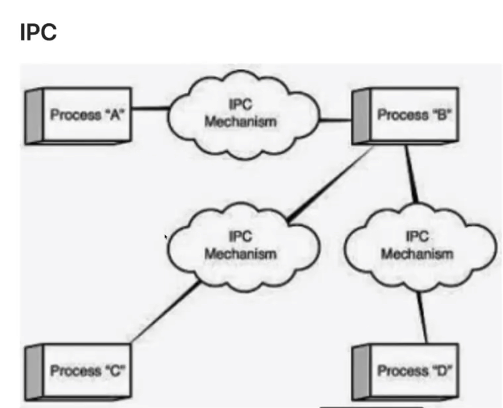
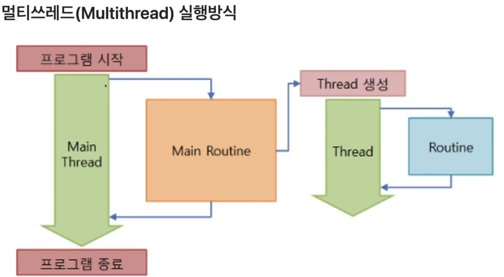
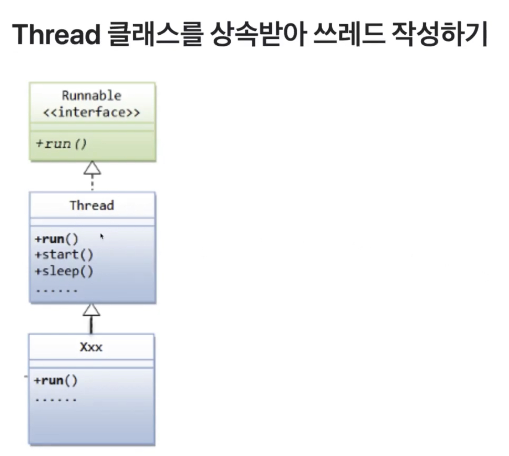

# Thread와 네트워킹 프로그래밍

## Thread


### 병렬화 할 때 고려해야 할 것들

- 메모리의 속도
- CPU 캐시 메모리
- 디스크
- 네트워크
- 커넥션
- 순차적 실행이 병렬실행보다 빠른 경우도 있다. 동시 실행에 따르는 오버헤드가 없고, 단일 CPU 알고리즘은 하드웨어 작업에 더 친화적일 수 있기 때문이다.
- …

### 암달의 법칙(Amdahl’s Law)

암달의 법칙은 암달의 저주로도 불리며 컴퓨터 시스템의 일부를 개선할 때 전체적으로 얼마만큼의 최대 성능 향상이 있는지 계산하는 데 사용된다. 진 암달의 이름에서 따왔다. 이론만 많은 컴퓨터과학 분야에서 몇 안 되는 법칙이다.


### Process

- 각각의 프로세스는 메모리 공간에서 독립적으로 존재한다.
- 각각의 프로세스는 다음 페이지 그림과 같이 자신만의 메모리 구조를 가진다.
- 프로세스 A,B,C가 있을 경우 각각 프로세스는 모두 같은 구조의 메모리 공간을 가진다.
- 독립적인 만큼 다른 프로세스의 메모리 공간에 접근할 수 있다.


### IPC

- 프로세스 A에서 프로세스 B를 직접 접근할 수 없기 때문에 프로세스 간의 통신을 하는 특별한 방식이 필요하다. 메일슬록(mailslot), 파이프(pipe)등이 바로 프로세스 간의 통신 즉, IPC의 예들이다.
- 프로세스는 독립적인 메모리 공간을 지니 때문에 IP를 통하지 않고 통신할수 없다.
- 프로세스가 여럿이 병렬적으로 실행되기 위해서는 필연적으로 컨텍스트 스위칭이 발생할 수 밖에 없다. 이것을 해결할 수 있는 것이 Thread이다.



### Thred

- 스레드는 하나의 프로그램 내에 존재하는 여러 개의 실행 흐름을 위한 모델이다.
- 우리가 생각하는 프로그램이 실행되기 위해서 하나의 실행흐름으로 처리할 수도 있지만 다수의 실행흐름으로 처리할 수도 있다.
- 뒤에 나오는 그림과 같이 스레드는 프로세스와 별개가 아닌 프로레스를 구성하고 실행하는 흐름이다.


### 스레드 vs 프로세스

- 스레드는 프로세스 안에 존재하는 실행흐름이다.
- 스레드는 프로세스의 heap, static, code 영역등을 공유한다.
- 스레드는 stack 영역을 제외한 메모리 영역은 공유한다.
- 스레드가 code영역을 공유하기 때문에 프로세스 내부의 스레드들은 프로세스가 가지고 있는 함수를 자연스럽게 모두 호출할 수 있다.
- 스레드는 IPC없이도 스레드 간의 통신이 가능하다. A, B 스레드는 통신하기 위해 heap영역에 메모리 공간을 할당하고, 두 스레드가 자유롭게 접글할 수있다.
- 스레드는 프로세스처럼 스케쥴링의 대상이다. 이 과정에서 컨텍스트 스위칭이 발생한다. 하지만 스레드는 공유하고 있는 메모리 영역 덕분에 컨텍스트 스위칭 때문에 발생하는 오버헤드가 프로세스에 비해 작다.
    - 동작중인 프로세스가 바뀔 때 프로세스는 현재 자신의 상태(context정보)를 일단 보존한 후, 새롭게 동작 개시하는 프로세스는 이전에 보존해 두었던 자신의 컨텍스트 정보를 다시 복구한다. 이와 같은 형상을 컨텍스트 스위칭이라 말한다.
    - 스레드의 컨텍스트 정보느 프로세스보다 적기 때문에 스레드의 컨텍스트 스위칭은 가볍게 행해지는 것이 보통이다.
    - 하지만, 실제로 스레드와 프로세스의 관계는 JVM 구현에 크게 의존한다.
- 참고로 플랫폼이 같아도 JVM의 구현방법에 따라 프로세스와 스레드의 관계는 달라질 수 있다.






## 예제

```java
package Thread;

public class MyThreadExam {
    public static void main(String[] args) {
        String name = Thread.currentThread().getName();
        System.out.println("Thread name : " + name);
        System.out.println("start");

        // 1초 마다 * 을 출력, 총 10번을 출력하는 프로그램을 작성하시오
        for (int i = 0; i < 10; i++) {
            System.out.print("*");

            try {
                Thread.sleep(1000);
            } catch (InterruptedException e) {
                e.printStackTrace();
            }
        } // for

        // 1초 마다 +를 출력, 총 10번을 출력하는 프로그램을 작성하시오
        for (int i = 0; i < 10; i++) {
            System.out.print("+");

            try {
                Thread.sleep(1000);
            } catch (InterruptedException e) {
                e.printStackTrace();
            }
        } // for
        System.out.println("end!");
    }
}
```

쓰레드가 동시에 실행되게 하고 싶다면..

```java
package Thread;

// 동시에 실행시키기

// 규칙
// 1. Thread 클래스를 상속받는다.
public class MyThread extends Thread {

    private String str;

    public MyThread(String str) {
        this.str = str;
    }

    // 2. run() 메소드를 오버라이딩 한다.
    // 동시에 실행시키고 싶은 코드를 작성한다.
    @Override
    public void run() {
        String name = Thread.currentThread().getName();
        System.out.println("--- " + name + " ---");

        // 1초 마다 str 을 출력, 총 10번을 출력하는 프로그램을 작성하시오
        for (int i = 0; i < 10; i++) {
            System.out.print(str);

            try {
                Thread.sleep(1000);
            } catch (InterruptedException e) {
                e.printStackTrace();
            }
        } // for
    }
}
```

```java
package Thread;

public class MyThreadExam {
    public static void main(String[] args) {
        String name = Thread.currentThread().getName();
        System.out.println("Thread name : " + name);
        System.out.println("start!");

        MyThread mt1 = new MyThread("*");
        MyThread mt2 = new MyThread("+");

        // 3. Thread 는 start() 메소드로 실행한다.
        mt1.start();
        mt2.start();

        System.out.println("end!");
    }
}
```


