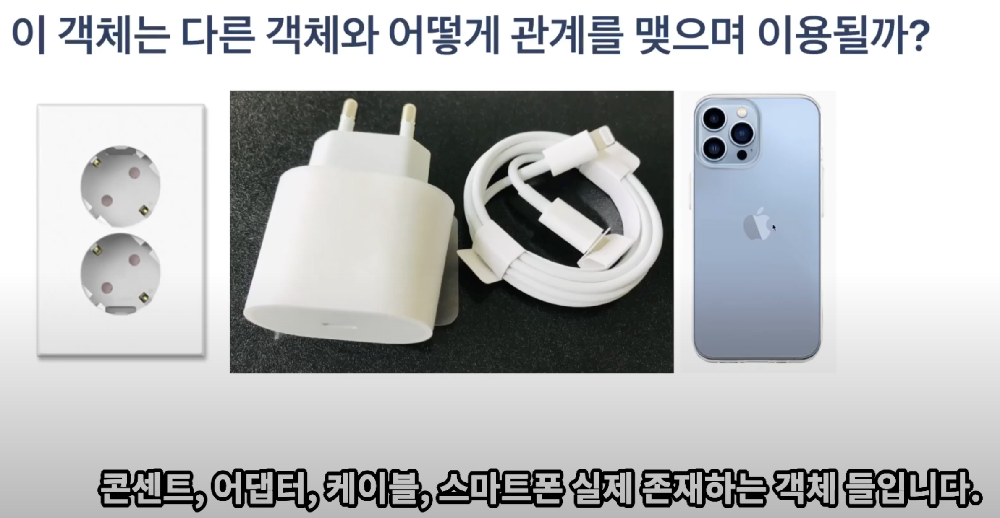

## 메소드, 메세지 교한 자판기에 메소드 추가하기



- 만들고 싶은 프로그램이 있다면, 그 프로그램을 구성하고 있는 객체들이 메모리에 몇 개가 올라가고, 메모리에 올라간 객체들 간에는 어떤 관계를 맺어야 할까? 를 생각한 후 클래스를 작성해야한다.

### 객체 지향의 핵심은 “메시징”

```java
의도는 "메시징"이다.
훌룡하고 성장 가능한 시스템을 만들기 위한 핵심은 모듈 내부의 속성과 행동이 어떤가보다
모듈이 어떻게 커뮤니케이션하는가에 달려있다.

Alan Curtis Kay
```

### 객체는 자율적인 책임을 가진다.

자율적인 객체란 스스로 정한 원칙에 따라 판단하고 스스로의 의지를 기반으로 행동하는 객체다. 객체가 어떤 행동을 하는 유일한 이유는 다른 객체로부터 요청을 수신했기 때문이다, 요청을 처리하기 위해 객체가 수행하는 행동을 책임이라고 한다.

자율적인 책임의 특징은 객체가 어떻게 해야 하는가가 아니라 무엇을 해야하는가를 설명한다는 것이다.

출처: 객체지향의 사실과 오해(출판사: 위키북스, 저자: 조영호)


### 메소드 이름은 앞에서 설명한 식별자 규칙과 같습니다. 다만, 메소드 이름은 소문자로 시작하는 것이 관례입니다.

### 헷갈리지 말자

- 매개변수(parameter) - 메소드의 정의 부분에 나열되어 있는 것들
- 전달인자(argument) - 메소드의 정의 부분에 나열되어 있는 것들

매개변수는 메소드의 정의부분에 나열되어 있는 변수들을 의미하며, 전달인자는 ㅁ소드를 호출할때 전달되는 실제 값을 의미한다.

### 자판기에 메소드를 추가한다.

```java
public String pushProductButton(int menuId)
```

- menuId가 1을 선택하면 “콜라”, 2가 선택되면 “사이다”, 3이 선택되면 “환타”를 반환한다.

### 예제

```java
package 객체지향문법_1;

public class VendingMachineMain {
    public static void main(String[] args) {
        VendingMachine vm1 = new VendingMachine(); // 자판기만 메모리에 생성

				// 리턴된 "콜라"는 product 변수가 참조하게 됨 
        String product = vm1.pushProductButton(100);
        System.out.println(product);
    }
}
```

```java
package 객체지향문법_1;

public class VendingMachine {
    // field (가지는 것들)

    // 생성자
    // method
    public String pushProductButton(int menuId) {
        System.out.println(menuId+"를 전달받았습니다.");
        return "콜라";
    }
}
```