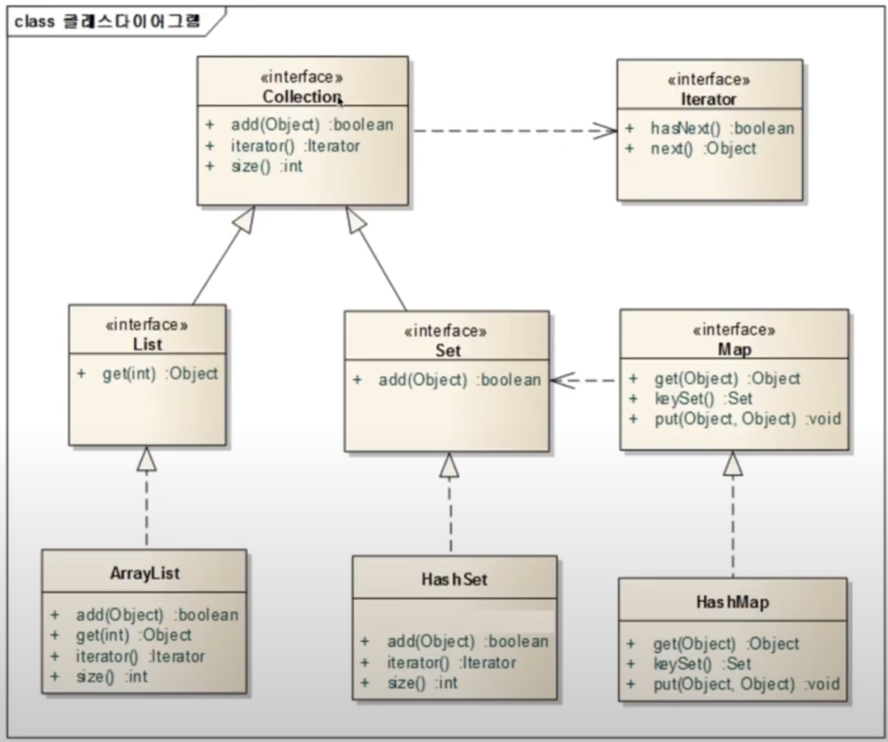

## 제네릭과 컬렉션 프레임워크

### 무엇이든 담을 수 있는 상자를 만들어 보자.

```jsx
public class ObjectBox {
	private Object object;
	
	public void set(Object obj) {
		this.object = obj;
	}
	
	public Object get() {
		return this.object;
	}
}
```

```jsx
package 배열과_컬렉션프레임워크.제네릭과_컬렉션프레임워크;

public class ObjectBoxMain {
    public static void main(String[] args) {
        ObjectBox box = new ObjectBox();
        box.set("kim");
        // Object 타입으로 받아서 리턴하기 때문에 String 타입으로 형변환
        String str = (String)box.get();
        System.out.println(str.toUpperCase());

        box.set(new Integer(5));
        Integer i = (Integer)box.get();
        System.out.println(i.intValue());
    }
}
```

꺼낼 때 형변환을 해줘야함, 객체를 담을 때는 특정 물품을 담는 경우가 많아서 타입을 지정할 수 있는 상자가 없을까?

### ObjectBox는 어떤 Object든 저장할 수 있고, 어떤 Object를 꺼낼 수 있다.

### 꺼내서 사용할 때는 원래 타입으로 변환시키는 번거로운 과정이 필요하다.

### GenericBox

```jsx
// 아직 정해지지 않은 어떤 타입을 쓰겠다
public class GenericBox<T> {
	private T t;
	
	public void set(T obj) {
		this.t = obj;
	}

	public T get() {
		return this.t;
	}
}
```

- T는 제네릭과 관련된 부분이다.
- 제네릭은 클래스 이름 뒤나, 메소드의 리턴타입 앞에 붙을 수 있다.
- <T>부분은 T라는 이름의 제네릭 타입을 선언한다는 것을 의미한다.
- T는 Type의 약자기 때문에 많이 사용되는 문자이지 꼭 T를 쓸 필요는 없다.
- T가 아니라 E나 D 등의 단어를 사용해도 된다.

```jsx
package 배열과_컬렉션프레임워크.제네릭과_컬렉션프레임워크;

public class GenericBoxMain {
    public static void main(String[] args) {
        GenericBox<String> genericBox = new GenericBox<>();
        genericBox.add("kim");
        String str = genericBox.get();
        System.out.println(str.toUpperCase());

        GenericBox<Integer> intBox = new GenericBox<>();
        intBox.add(new Integer(5));
        Integer intValue = intBox.get();
        System.out.println(intValue);

        GenericBox<Object> objBox = new GenericBox<>();
        objBox.add("hello");
        String str2 = (String)objBox.get();
        System.out.println(str2);
    }
}
```

### 제네릭의 장점

- 정해진 타입만 사용하도록 강제할 수 있다.
- 타입을 강제함으로써 컴파일할 때 잘못된 타입의 값이 저장되는 것을 막을 수 있다.

## 컬렉션 프레임워크

### 컬렉션 프레임워크란?

- Java Collection Framework 라고 불리워지는 Collection API는 Java 2부터 추가 된 자료구조 클래스 패키지를 말한다.
- 자료(Data)를 다룰 때 반드시 필요한 클래스의 모음으로써 Java 프로그래머라면 꼭 숙지하고 있어야만 한다.

### 컬렉션 프레임워크의 핵심 인터페이스



- 점섬 : 의존한다
- 그냥 화살표 : 상속받는다

### java.util.Collection 인터페이스

- java.util.Collection 인터페이스는 컬렉션 프레임워크에서 가장 기본이 되는 인터페이스이다.
- 해당 인터페이스는 순서를 기억하지 않고, 중복을 허용하여 자료를 다루는 목적으로 만들어졌다.

### java.util.List 인터페이스

- java.util.List 인터페이스는 순서가 중요한 자료를 다룰때 사용하는 인터페이스이다.
- Collection을 상속받음으로써 Collection이 가지고 있는 add(), size(), iterator()메소드를 사용할 수 있다.
- 해당 인터페이스는 순서를 알고 있다고 가정하기 때문에 특정 순서로 저장된 자료를 꺼낼 수 있는 get(int) 메소드를 가지고 있다.

### java.util.Set 인터페이스

- java.util.Set 인터페이스는 중복을 허용하지 않는 자료를 다룰 때 사용하는 인터페이스이다.
- 중복을 허용하지 않는다는 것은 같은 값을 저장할 수 없다는 것이다.
- 같은 값을 여러번 추가하여도 마지막 값 하나만 저장됨을 의미한다.
- Set 인터페이스에 저장되는 객체들은 Object가 가지고 있는 equals()메소드와 hashCode()메소드를 오버라이딩해야한다.

### java.util.Iterator 인터페이스

- java.util.Iterator 인터페이스는 자료구조에서 자료를 꺼내기 위한 목적으로 사용되는 인터페이스이다.
- Iterator 패턴을 구현하고 있다.

### [java.util.Map](http://java.util.Map) 인터페이스

- [java.util.Map](http://java.util.Map) 인터페이스는 키(key)와 값(Value)를 함께 저장하기 위한 목적으로 만들어진 인터페이스이다.
- 같은 Key값으론 하나의 값만 저장할 수 있다.

### 제네릭을 사용하지 않고 ArrayList 사용하기

```java
package 배열과_컬렉션프레임워크.제네릭과_컬렉션프레임워크;

import java.util.ArrayList;

public class ListExam01 {
    public static void main(String[] args) {
        // 자료구조객체들은 제네릭을 사용하지 않으면
        // Object 타입을 저장합니다.
        ArrayList list = new ArrayList();
        list.add("kim");
        list.add("lee");
        list.add("hong");

        String str1 = (String)list.get(0);
        String str2 = (String)list.get(1);
        String str3 = (String)list.get(2);

        System.out.println(str1);
        System.out.println(str2);
        System.out.println(str3);
    }
}
```

### 제네릭을 사용하고 ArrayList 사용하기

```java
package 배열과_컬렉션프레임워크.제네릭과_컬렉션프레임워크;

import java.util.ArrayList;

public class ListExam02 {
    public static void main(String[] args) {
        ArrayList<String> list = new ArrayList<>();
        list.add("kim");
        list.add("lee");
        list.add("hong");

        String str1 = list.get(0);
        String str2 = list.get(1);
        String str3 = list.get(2);

        System.out.println(str1);
        System.out.println(str2);
        System.out.println(str3);
    }
}
```

### Collection & Iterator

```java
package 배열과_컬렉션프레임워크.제네릭과_컬렉션프레임워크;

import java.util.ArrayList;
import java.util.Collection;
import java.util.Iterator;

public class ListExam03 {
    public static void main(String[] args) {
        Collection<String> collection = new ArrayList<>();
        collection.add("kim");
        collection.add("lee");
        collection.add("hong");

        System.out.println(collection.size());

        Iterator<String> iter = collection.iterator();
        while(iter.hasNext()) {
            String str = iter.next();
            System.out.println(str);
        }
    }
}
```

### List

```java
package 배열과_컬렉션프레임워크.제네릭과_컬렉션프레임워크;

import java.util.ArrayList;
import java.util.List;

public class ListExam02 {
    public static void main(String[] args) {
        List<String> list = new ArrayList<>();
        list.add("kim");
        list.add("lee");
        list.add("hong");

        String str1 = list.get(0);
        String str2 = list.get(1);
        String str3 = list.get(2);

        System.out.println(str1);
        System.out.println(str2);
        System.out.println(str3);
    }
}
```

### Set

```java
package 배열과_컬렉션프레임워크.제네릭과_컬렉션프레임워크;

import java.util.HashSet;
import java.util.Iterator;
import java.util.Set;

public class SetExam {
    public static void main(String[] args) {
        Set<String> set = new HashSet<>();
        boolean flag1 = set.add("hello");
        boolean flag2 = set.add("hi");
        boolean flag3 = set.add("hong");
        // 중복을 허용하지 않음
        boolean flag4 = set.add("hong");
        System.out.println(flag1);
        System.out.println(flag2);
        System.out.println(flag3);
        System.out.println(flag4);

        Iterator<String> iter = set.iterator();
        while (iter.hasNext()) {
            String str = iter.next();
            System.out.println(str);
        }
    }
}
```

### Set2

```java
package 배열과_컬렉션프레임워크.제네릭과_컬렉션프레임워크;

import java.util.HashSet;
import java.util.Iterator;
import java.util.Objects;
import java.util.Set;

public class SetExam2 {
    public static void main(String[] args) {
        // Hash 라는 알고리즘이 나오면 Object가 가지고 있는 equals와 hashCode 메소드를 오버라이딩 해야한다.
        Set<MyData> mySet = new HashSet<>();
        mySet.add(new MyData("kim", 500));
        mySet.add(new MyData("lee", 200));
        mySet.add(new MyData("hong", 700));
        // equals 와 hashcode 가 있어서 중복된 값이 안나옴
        mySet.add(new MyData("hong", 700));

        // Iterator를 사용하는 패턴
        Iterator<MyData> iterator = mySet.iterator();
        while (iterator.hasNext()){
            MyData myData = iterator.next();
            System.out.println(myData);
        }
    }
}

class MyData {
    private String name;
    private int value;

    public MyData(String name, int value) {
        this.name = name;
        this.value = value;
    }

    public String getName() {
        return name;
    }

    public int getValue() {
        return value;
    }

    @Override
    public boolean equals(Object o) {
        System.out.println("equals!!!");
        if (this == o) return true;
        if (o == null || getClass() != o.getClass()) return false;
        MyData myData = (MyData) o;
        return value == myData.value && Objects.equals(name, myData.name);
    }

    @Override
    public int hashCode() {
        System.out.println("hashcode!!!");
        return Objects.hash(name, value);
    }

    // toString 메소드를 오버라이딩해야 정상적인 값을 출력할 수 있음

    @Override
    public String toString() {
        return "MyData{" +
                "name='" + name + '\'' +
                ", value=" + value +
                '}';
    }
}
```

### Map

```java
package 배열과_컬렉션프레임워크.제네릭과_컬렉션프레임워크;

import java.util.HashMap;
import java.util.Map;

public class MapExam {
    public static void main(String[] args) {
        Map<String, String> map = new HashMap<>();
        map.put("k1", "hello");
        map.put("k2", "hi");
        map.put("k3", "안녕");
        // 원래 있던 값이 바뀐다
        map.put("k3", "안녕하세요");

        System.out.println(map.get("k1"));
        System.out.println(map.get("k2"));
        System.out.println(map.get("k3"));
    }
}
```

### Map2

```java
package 배열과_컬렉션프레임워크.제네릭과_컬렉션프레임워크;

import java.util.HashMap;
import java.util.Iterator;
import java.util.Map;
import java.util.Set;

public class MapExam2 {
    public static void main(String[] args) {
        Map<String, String> map = new HashMap<>();
        map.put("k1", "hello");
        map.put("k2", "hi");
        map.put("k3", "안녕");

        Set<String> keySet = map.keySet();
        Iterator<String> iterator = keySet.iterator();
        while (iterator.hasNext()) {
            String key = iterator.next();
            String value = map.get(key);

            System.out.println(key+" : "+value);
        }
    }
}
```

### 정렬하기

```java
package 배열과_컬렉션프레임워크.제네릭과_컬렉션프레임워크;

import java.util.ArrayList;
import java.util.Collections;
import java.util.List;

public class SortExam {
    public static void main(String[] args) {
        List<String> list = new ArrayList<>();
        list.add("kim");
        list.add("lee");
        list.add("hong");

        // 자료구조에서 유용한 메소드를을 모아둔 클래스
        Collections.sort(list);

        for(int i=0; i< list.size(); i++) {
            System.out.println(list.get(i));
        }
    }
}
```

### 섞기

```java
package 배열과_컬렉션프레임워크.제네릭과_컬렉션프레임워크;

import java.util.ArrayList;
import java.util.Collections;
import java.util.List;

public class ShuffleExam {
    public static void main(String[] args) {
        List<String> list = new ArrayList<>();
        list.add("kim");
        list.add("lee");
        list.add("hong");

        Collections.shuffle(list);

        for(int i=0; i< list.size(); i++) {
            System.out.println(list.get(i));
        }
    }
}
```