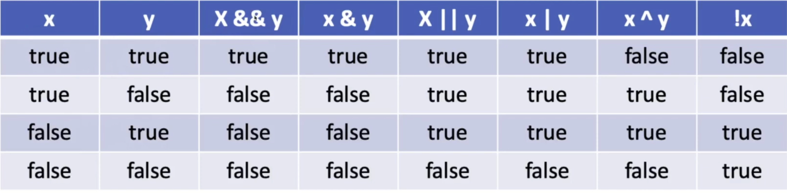

## 논리형 타입과 논리 연산자

### 자바의 타입에는 기본형 타입 (primitive type) 과 레퍼런스 타입 (reference type) 2가지 종류가 있다.

- 기본형 타입은 논리형, 문자형, 정수형 실수형이 존재한다.
- 기본형 타입 중 논리형 타입은 boolean 키워드를 사용한다.
- 기본형 타입 중 정수형 타입은 byte, short, int, long 키워드를 사용한다.
- 기본형 타입 중 실수형 타입은 float, double 키워드를 사용한다.
- 기본형 타입 중 문자형 타입은 char 키워드를 사용한다.
- 이를 제외한 모든 타입은 레퍼런스 타입이다.

### 참인가? 거짓인가?

- 프로그래밍은 어떤 조건에 따라서 다르게 동작하게 코드를 작성하는 경우가 많다.
- 온도가 30도 이상일 때 동작한다. 가격이 5000원 이하일 때 동작한다. 등의 표현을 보자. 여기에서 “30도 이상”, “5000원 이하”가 조건이라고 말할 수 있다. 이러한 조건의 결과는 참(true)이나 거짓(false)이 나오게 된다.
- 이러한 참이나 거짓을 저장하는 변수를 논리형 타입 변수라고 한다.

### 논리형 타입 boolean 사용하기

- boolean 타입은 true, false 2가지 값중에 하나를 가질 수 있다.
- 초기하지 않으면 기본적으로 false 값을 가진다, 참고로 메소드 안에서는 변수를 선언한 후 초기화하지 않고 사용하면 java: variable 변수명 might not have been initialized 와 같은 오류가 발생한다.
- 클래스 안에 선언된 변수는 필드(feild)라 말하고 초기화 하지 않아도 사용 가능하다.

### 논리형 타입은 언제 사용할까?

- 논리형 타입 변수는 논리연산의 결과를 저장할 때 사용한다.
- 논리연산이란 무엇일까? 예를 들어 a라는 변수가 10보다 크고 30보다 작을 경우라는 조건이 있을 때, 이러한 조건의 결과가 저장되는 변수가 논리형 타입 변수이다.
- a가 만약 20이라면 true가 되겠고, a가 5라면 false가 위의 조건의 결과가 된다.

### 참(true)과 거짓(false)이 나오는 식

- 비교연산자와 논리연산자를 이용한 식의 결과는 참이나 거짓이 결과로 나온다.
- 비교 연산자 : ==, ≠, <, >, ≤, ≥
- 논리 연산자 : &&, ||, &, |, ^, !
- 비교 연산자, 논리 연산자와 함께 산술 연산자도 함께 사용될 수 있다. 산술 연산자는 덧셈, 뺄셈등을 말한다.

### 비교 연산자란?

- 10은 5보다 크다. 참인가? 거짓인가? 자바에서 표현하면 다음과 같다.

```java
10 > 5
```

- 위의 식의 결과를 변수에 저장하고 싶다면? 아래와 같이 표현한다. flag는 노리형 타입 변수로 false로 초기화 된다. 그리고 나서 10이 5보다 크다가 참이라면 flag는 true값을 가지게 된다.

```java
boolean flag = flase;
flag = 10 > 5;
```

### 예제1

- 실행해 보기전에 결과를 예상해보자. System.out.println(boolean)은 논리형 값을 출력한다.

```java
package 자바_기본_문법;

public class BooleanTest1 {
    public static void main(String[] args) {
        boolean flag1 = false;
        boolean flag2 = false;
        boolean flag3 = false;
        boolean flag4 = false;
        boolean flag5 = false;
        
        flag1 = 10 > 5;
        flag2 = 10 < 5;
        flag3 = 10 >= 10;
        flag4 = 10 <= 10;
        flag5 = 10 == 10;

        System.out.println(flag1);
        System.out.println(flag2);
        System.out.println(flag3);
        System.out.println(flag4);
        System.out.println(flag5);
    }
}
```

### 논리연산자 and (&&)와 or (||)

- a는 20보다 크고, a는 50보다 작다. 라는 표현은 자바에서 다음과 같이 표현한다.

```java
a > 20 && a < 50
```

- ‘a는 20보다 크거나, a는 50보다 작다’ 라는 표현은 자바에서 다음과 같이 표현한다.

```java
a > 20 || a < 50
```

2가지 조건을 모두 만족해야 하는 경우엔 and 연산자인 &&를 사용하고, 2가지 조건 주 하나만 만족해도 될 경우에는 ||를 사용한다.

&& 대신에 &를 || 대신에 | 를 사용해도 같은 결과가 나온다.

### 논리 연산자 ^(exclusive-or 또는 XOR 라고 말한다.)

- 2개의 식의 논리 값이 서로 다를 경우 참이 된다. 아래의 식이 참이려면 한쪽은 참이고, 한쪽은 거짓이 나와야 한다. 예를 들어 a가 31이라는 값을 가질 경우 true & false 가 되니 이때 결과는 참이 나온다.

```java
a > 10 ^ a < 20 
```

### 부정 연산자 !

- 논리형 값을 부정한다. true는 false로 바꾸고, false는 true로 바꾼다. 10은 5보다 크다는 참이다. 하지만 그 결과를 부정하게 되니 논리형 변수 a에는 false가 저장되게 된다.

```java
boolean a = !(10 > 5);
```

### 논리 연산자 정리



### 예제2

```java
package 자바_기본_문법;

public class BooleanTest2 {
    public static void main(String[] args) {
        boolean flag1 = false;
        boolean flag2 = false;
        boolean flag3 = false;
        boolean flag4 = false;
        boolean flag5 = false;
        boolean flag6 = false;
        
        // &&는 앞이 거짓이면 뒤는 실생하지 않는다. 
        flag1 = 10 > 5 && 5 < 20;
        flag2 = 10 > 5 & 5 < 20;
        // || 역시 앞이 참이면 뒤는 실행하지 않는다.
        flag3 = 10 >= 10 || 5 > 6;
        flag4 = 10 >= 10 | 5 > 6;
        flag5 = 10 == 10 ^ 5 == 4;
        flag6 = !flag5;

        System.out.println(flag1);
        System.out.println(flag2);
        System.out.println(flag3);
        System.out.println(flag4);
        System.out.println(flag5);
        System.out.println(flag6);
    }
}
```

### 불린형 타입은 메모리를 얼마나 사용할까?

- 불린형 타입은 1byte(8bit)를 사용한다. 사실 1비트로도 참과 거짓은 표현할 수 있다. 0은 거짓, 1은 참으로 표현하면 된다. 하지만 컴퓨터는 자료를 표현하는 최소 단위가 1byte이다. 그렇기 때문에 불린형 타입은 메모리에 1byte를 사용하게 된다.