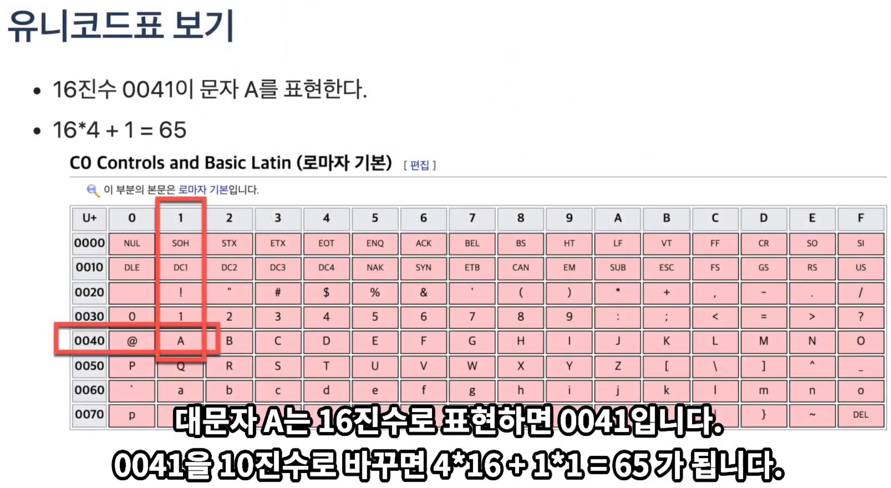

## 문자(char)타입

### 문자타입

- 문자는 작은 따옴표로 묶인 문자 하나를 말한다.
- 문자는 2byte 크기를 가지며 유니코드 값을 가진다.
- 아래의 위키페이지를 보면 유니코드 값을 확인할 수 있다.
    - [https://ko.wikipedia.or/wiki/유니코드](https://ko.wikipedia.org/wiki/%EC%9C%A0%EB%8B%88%EC%BD%94%EB%93%9C)



- 유니코드 65번째 글자는 대문자 A, 97번째 글자는 소문자 a (암기)

### 문자 타입은 정수 타입이기도 하다.

- 문자 타입은 0부터 65535까지 저장할 수 있는 정수 타입이기도 하다.

### 예제 - 문자를 정수형으로, 정수를 문자로 변환

- 유니코드 97번째 값은 문자 ‘a’이다. (유니코드 표를  확인하자.)

```java
package 자바_기본_문법;

public class CharExam2 {
    public static void main(String[] args) {
        char c1 = 'a';

        System.out.println((int)c1);

        char c2 = (char)97;

        System.out.println(c2);
    }
}
```