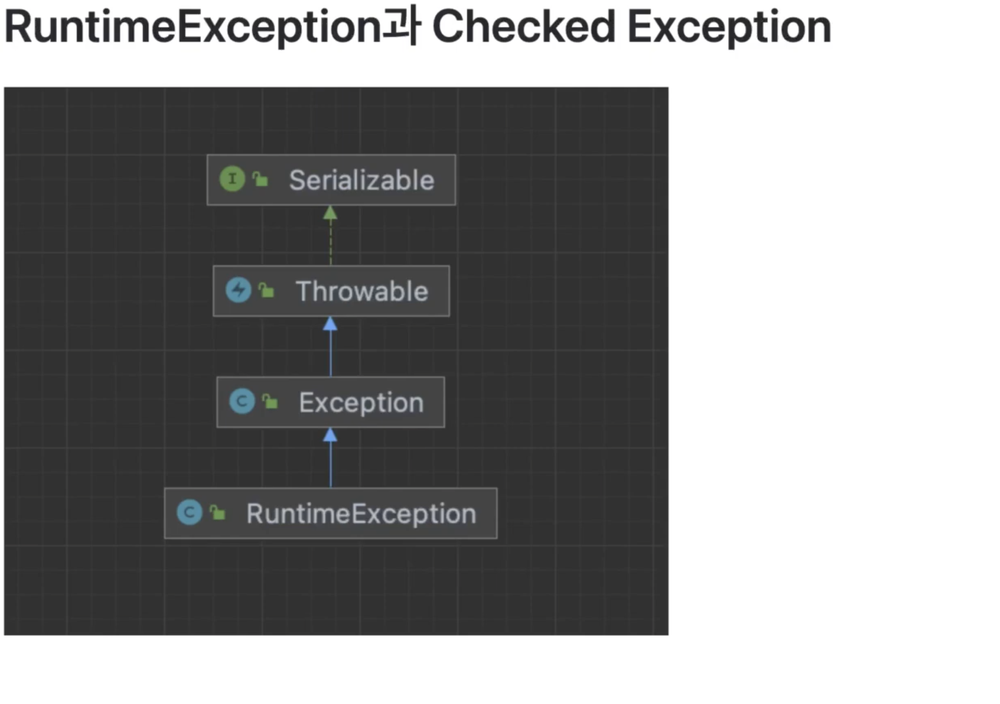
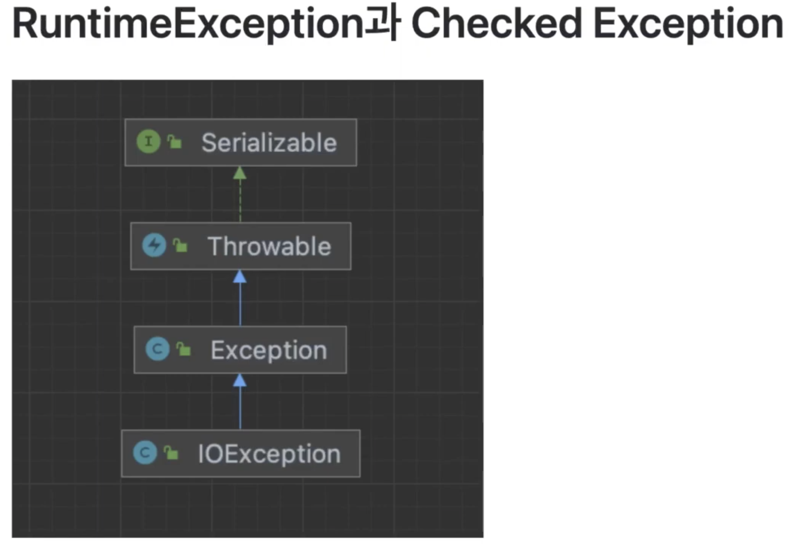

## 예외처리 하기

## Error와 Exception

- 비정상적으로 프로그램을 종료되게 하는 원인

### 자바에서는 실행시 2가지 형태의 오류가 발생할 수 있다.

- Error : 수습할 수 없는 심각한 오류
- Exception(예외) : 예외 처리를 통해 수습할 수 있는 덜 심각한 오류
- 메모리 부족, 스택오버플로우(stack overflow)등이 발생하여 프로그램이 죽는 것은 프로그래머가 제어할 수 없다.

### 예외 처리란?

- 아래의 코드를 실행하면?

```java
package 예외처리;

public class Exception1 {
    public static void main(String[] args) {
        ExceptionObj1 exObj = new ExceptionObj1();
        int value = exObj.divide(10, 0);
        System.out.println(value);
    }
}

class ExceptionObj1 {
    public int divide(int i, int k) {
        int value = 0;
        value = 1 / k;
        return value;
    }
}
```

### 예외처리 하기(try-catch)

```sql
package 예외처리;

public class Exception1 {
    public static void main(String[] args) {
        ExceptionObj1 exObj = new ExceptionObj1();
        int value = exObj.divide(10, 0);
        System.out.println(value);
    }
}

class ExceptionObj1 {
    public int divide(int i, int k) {
        int value = 0;
        try {
            value = 1 / k;
        } catch (ArithmeticException ex) {
            System.out.println("0으로 나눌 수 없어요");
            System.out.println(ex.toString());
        }
        return value;
    }
}
```


### 예외 떠넘기기(throw)

```java
package 예외처리;

public class Exception2 {
    public static void main(String[] args) {
        ExceptionObj2 exObj = new ExceptionObj2();
        try {
            int value = exObj.divide(10, 0);
        } catch (ArithmeticException ex) {
            System.out.println("0으로 나눌 수 없어요");
        }
    }
}

class ExceptionObj2 {
    /**
     * i 를 k로 나눈 나머지를 반환한다.
     * @param i
     * @param k
     * @throws ArithmeticException
     * **/
    public int divide(int i, int k) throws ArithmeticException{
        int value = 0;
        value = i / k;
        return value;
    }
}
```



- RuntimeException을 상속받고 있는 Exception은 모두 Runtimeexception이라고 부른다.
- 실행시 오류가 나서 종료됨





- RuntimeExeption을 제외한 Exception들은 Checked Exception이다.
- 사용자 정의 Exception을 만들 때는 RuntimeException으로 만드는게 좋다.

### 예시

```java
package 예외처리;

import java.io.FileInputStream;
import java.io.FileNotFoundException;

public class Exception3 {
    public static void main(String[] args) {
        try {
            FileInputStream fis = new FileInputStream("Exception3.java");
        } catch (FileNotFoundException ex) {
            System.out.println("파일을 받지 못했습니다.");
        }
    }
}
```

### 다중 Exception 처리

```sql
package 예외처리;

public class Exception4 {
    public static void main(String[] args) {
        int[] array = {4,2};
        int[] value = new int[1];
        try{
            value[0] = array[0] / array[1];
            // 특정 예외들
        } catch (ArrayIndexOutOfBoundsException aiob) {
            System.out.println(aiob.toString());
        } catch (ArithmeticException ae) {
            System.out.printf(ae.toString());
            // 미쳐 모르는 Exception
        } catch (Exception ex) {
            System.out.println(ex.toString());
        }
    }
}
```

### 사용자 정의 Exception

```java
package 예외처리;

public class MyException extends RuntimeException{
    // 오류 메세지나, 발생한 Exception을 감싼 결과로 내가 만든 Exception을 사용하고 싶을 때가 많다.

    public MyException(String message) {
        super(message);
    }

    public MyException(Exception cause) {
        super(cause);
    }
}
```

```java
package 예외처리;

public class Exception5 {
    public static void main(String[] args) {
        try {
            ExceptionObj5 exObj = new ExceptionObj5();
            int value = exObj.divide(10, 0);
            System.out.println(value);
        } catch (MyException ex) {
            System.out.println("사용자 정의 Exception이 발생했네요.");
        }
    }
}

class ExceptionObj5 {
    public int divide(int i, int k) throws MyException{
        int value = 0;
        try {
            value = 1 / k;
        } catch (ArithmeticException ex) {
            throw new MyException("0으로 나눌 수 없습니다.");
        }
        return value;
    }
}
```